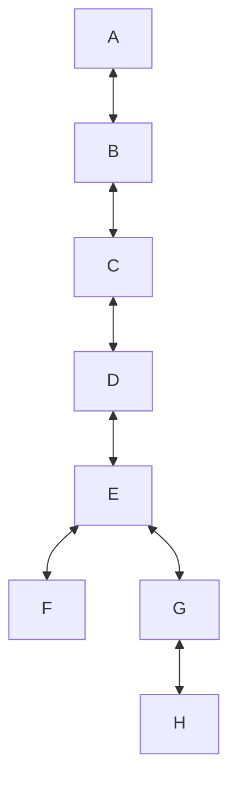

# docker_network_pivoting_playground
This is a *Docker* network created to practice network pivoting at increasing levels of depth.

Just use the `docker-compose.yml` to build and run the network. The build takes a lot of time to install samba. Ports *80* and *445* of the first container are exposed on the host: they are the public point of access.

All the containers are the same, so that you can exploit the first and then focus on the host discovery through pivoting and repeat the exploitation through tunnels. A situation like this is also the perfect playground to develop a *worm*.

**Spoiler alert**: *Harry Potter* fans will appreciate.

## Spoiler of the challenge
The network topology is like this:

The replicated container is a `LAMP` machine, that has the *SMB* service with public R/W access to the path in which *PHP* files for the application are hosted. This is the only attack path. It's also a good utility to bring tools on the system, such as static binaries to check for connectivity, like *ping*, *ifconfig*, *nmap*.
